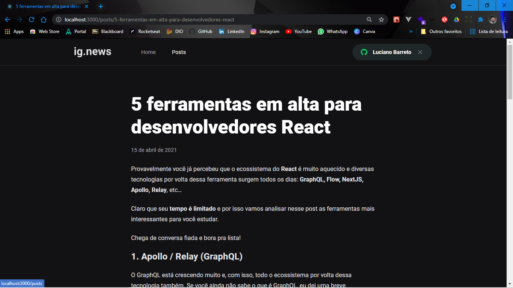
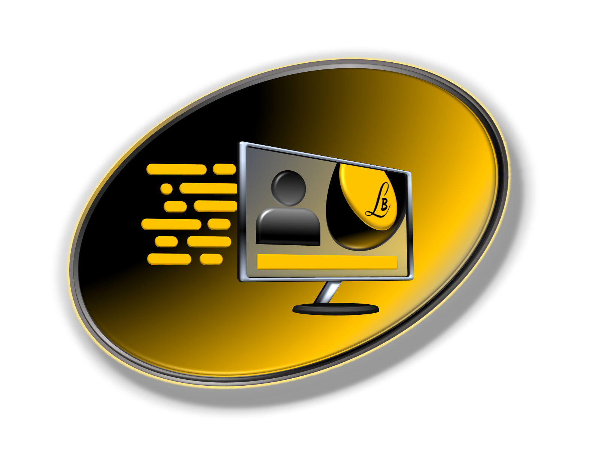

<p align="center">
  
</p>

<br>

<p align="center">
    
</p>

<p align="center">
 <a href="#sobre-o-projeto">Sobre o Projeto</a> •
 <a href="#tecnologias">Tecnologias</a> •
 <a href="#configurações-necessárias">Configurações necessárias</a> •
 <a href="#licença">Licença</a>
</p>

## Sobre o projeto

O projeto tem como objetivo o estudo e desenvolvimento de uma aplicação em ReactJS com NextJS para listagem de posts e sistema de inscrição(subscription).

A aplicação foi desenvolvida utilizando o framework NextJS aplicando conceitos como consumo de API externas, API Root, Server Side Rendering (SSR), Static Site Generation (SSG), STRIPE para pagamentos das subscriptions, NextAuth para autenticação com Github, FaunaDB para armazenar as informações do usuário em um banco de dados e Prismic CMS para adição e gerenciamento do conteúdo dos posts.

<br>

<p align="center">
  <kbd></kbd>
</p>
<p align="center">
  <kbd></kbd>
</p>

<br>

<h5 align="center">O Next.js transforma a nossa maneira de desenvolver aplicações front-end e conceitos importantes como SSR e SSG. Também como o front-end se transformou nos últimos anos com a possibilidade de termos funções back-end (serverless) executando em um ambiente front-end. É muito comum o desenvolvimento de aplicações front-end que não estão conectadas a um único back-end hoje em dia, por isso, aqui está o conceito de JAMStack e como conectar nosso front-end com um CMS.  :octocat:</h5>

<br>

<h5 align="center">Login com Github para acesso aos posts</h5>


<p align="center">
    <kbd></kbd>
</p>

<br>

<h5 align="center">Cliente logado</h5>

<br>

<p align="center">
    <kbd></kbd>
</p>

<br>

<p align="center">
    <kbd></kbd>
</p>

<br>

<p align="center">
    <kbd></kbd>
</p>

<br>

---

## Tecnologias

Abaixo as tecnologias utilizadas para construção da aplicação

- [ReactJS](https://reactjs.org/)
- [NextJS](https://nextjs.org/)
- [TypeScript](https://www.typescriptlang.org/)
- [SASS](https://sass-lang.com/)
- [Next-Auth](https://next-auth.js.org/)
- [Stripe](https://stripe.com/)
- [FaunaDB](https://fauna.com/)
- [Prismic CMS](https://prismic.io/)

---

## Configurações necessárias

### **Requisitos**

Necessário realizar as instalações:

- [Git](https://git-scm.com/)
- [Yarn](https://classic.yarnpkg.com)
- [Stripe CLI](https://stripe.com/docs/stripe-cli)

Criar conta e configurar os serviços externos:

- [Stripe](https://stripe.com/)
- [FaunaDB](https://fauna.com/)
- [Prismic CMS](https://prismic.io/)

*Configurações dos serviços estão localizadas no arquivo servicesConfig.md na raiz do projeto.*

### **Clone do projeto**

```bash
# Execute o comando git clone para realizar o clone do repositório
$ git clone https://github.com/Lucianobarretto/ignews.git
# Entre na pasta do repositório clonado
$ cd ignews
```

### **Iniciando o projeto**

```bash
# Execute yarn para instalar as dependências
$ yarn

# Na raiz do projeto crie uma copia do arquivo .env.local.example
# Altere o nome da copia para .env.local
# Preencha as variáveis ambiente de acordo com as instruções
$ cp .env.local.example .env.local

# Execute stripe listen para ouvir eventos do webhook
$ stripe listen --forward-to localhost:3000/api/webhooks 

# Para iniciar a aplicação
$ yarn dev

```

---

## Licença

Esse projeto está sob sob a licença MIT. Veja [LICENSE](LICENSE) para mais detalhes.

<br>

<p align="center">  
  <a href="https://github.com/Lucianobarretto/letmeask/blob/master/LICENSE.md">
    
  </a>
</p>

---

<p align="center">
  
</p>

<p align="center">  
  <a href="https://www.linkedin.com/in/lucianobalmeida/">
    
  </a>  
</p>
